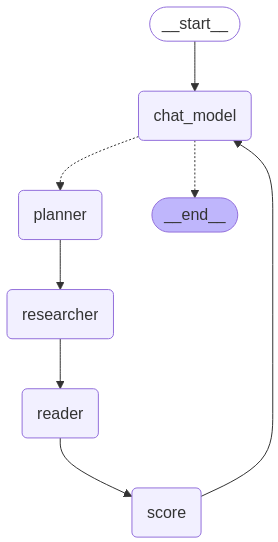

# 🛡️ SentinelAI – Corporate Reputation Diagnosis in the Media

**SentinelAI** is an intelligent system composed of multiple agents that collect, analyze, and synthesize public information about companies, focusing on reputation and public perception in the media. It delivers structured diagnostics by reputational dimension (such as ESG, Ethics, Governance, etc.), using a modular, conversational, and explainable approach.

---

## 🚀 Key Features

- 🔍 Strategic news search by analysis dimension  
- 🧠 Automated and structured interpretation of news content  
- 📊 Generation of normalized reputation metrics (0–5)  
- 💬 Conversational interface with a reputation expert agent  
- 📈 Strategic diagnosis based on sentiment, impact, and relevance  
- 🏷️ Classification by source type (mainstream media, specialized, official, etc.)

---

## 🧠 Agent Architecture

The system consists of 6 main agents, each with a specific role in the workflow:

| Agent                          | Role                                                   |
|-------------------------------|--------------------------------------------------------|
| **Search Planner**            | Collection strategy per analysis dimension             |
| **Search & Relevance Executor**| Searches trusted sources (via the internet) and curates relevant news |
| **Reader/Analyzer**           | Semantic interpretation of news content                |
| **Metric Generator**          | Calculates reputation score (0–5)                      |
| **Conversational Supervisor** | Interacts with users and provides strategic synthesis  |

---

## 📊 About the Reputation Metric

The score per reputational dimension is calculated based on:

- **News sentiment** (positive, neutral, negative)  
- **Impact intensity** (very high, high, moderate, low)  
- **Source weight** (influence and credibility of the outlet)  
- **Strategic relevance** of the information  

These factors are weighted and transformed into a **normalized score between 0 and 5**. The absence of news is also accounted for in the reputation logic, reflecting neutrality or reduced visibility.

[📄 View full metric documentation.](https://sentinelaiscore.streamlit.app/score_page)

---

## 🧭 System Workflow



---

## 🧪 Usage Example

```bash
# Interaction with the conversational agent
User: "I’d like to know how Vale’s reputation is doing in ESG."
SentinelAI: "The ESG dimension score is 4.3. The company has been highlighted in sustainability rankings..."
```

---

## ⚙️ Installation & Execution

```bash
# 1. Clone the repository
git clone https://github.com/your-username/sentinelai.git
cd sentinelai

# 2. Install the dependencies
pip install -r requirements.txt

# 3. Run the main app
python main.py
```

---

## 📬 Contact  
Have questions or suggestions?

Get in touch with the team:

📧 Email: micaelle.osouza@gmail.com  
🌐 Website: https://sentinelaiscore.streamlit.app/

Feel free to open Issues in this repository to report bugs, suggest improvements, or request features.
